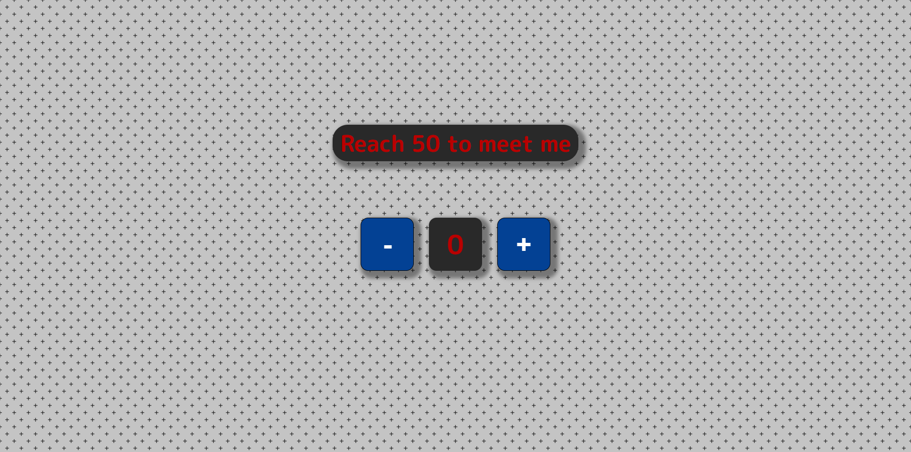

# Start to Impact - Counter and Presentation Card

 <!-- Replace with your project screenshot -->

## 🔗 Live Demo
[Demo](https://skelman016.github.io/counter-project/) <!-- Replace with your live demo link if available -->

## Description

This project is a simple interactive **counter** with a **presentation card** that appears after the counter reaches a specific value. The project allows the user to increment and decrement a counter, with visual feedback when the counter reaches certain milestones, and includes a button to reveal a personal profile card.

### Key features:
- A **counter** with + and - buttons to increase or decrease the value.
- A **message** that updates based on the counter value (e.g., "Reach 50 to meet me" and "Keep it up!").
- A **presentation card** that includes a profile image, links to social profiles (LinkedIn, GitHub), and a personal portfolio.
- The presentation card appears when the counter reaches a limit, providing the user with an engaging interaction.

## Features

- **Interactive counter** that updates dynamically.
- **Responsive design** to ensure usability across different screen sizes.
- **Personal profile card** with links to social media and portfolio.
- **CSS animations and transitions** to enhance the user experience.

## Technologies Used

- **HTML5** for the structure and content.
- **CSS3** for styling.
  - Flexbox for layout management.
  - CSS transitions for smooth animations.
- **JavaScript** for dynamic DOM manipulation.
  - Event listeners for button interactions.
  - Real-time updates based on user input.

## Project Structure

```bash
counter-project/
│── index.html      # Main HTML file
└── assets/         
   ├── img/         
   │   ├── Profileimg.png       # Profile Image
   │   ├── logo/                
   │   │   ├── LinkedIN_white.png  # LinkedIn logo
   │   │   └── Github_white.png   # GitHub logo
   ├── css/         
   │    ├── styles.css
    │   └── background-style.css          # Stylesheet for the layout and design
   └── js/             
       └── script.js            # JavaScript file containing all the logic
```

## Installation & Setup

1. **Clone the repository**  
   ```bash
   git clone https://github.com/Skelman016/counter-project.git
   ```
2. **Open the `index.html` file in your browser**  
3. *(Optional)* If using a live server, start it with:  
   ```bash
   npx live-server
   ```

## What I Learned

- Enhanced my understanding of **DOM manipulation** in JavaScript, particularly creating and appending elements dynamically.
- Learned how to manage **CSS transitions** and **animations** to make interactive elements more engaging.
- Refined my skills in **event handling** and **dynamic content updates** based on user input.

## License

This project is licensed under the **MIT License** – feel free to modify and reuse it.

## Author

- **GitHub**: [Skelman016](https://github.com/Skelman016)  
- **LinkedIn**: [My Profile](https://www.linkedin.com/in/marioromagnoli016/)  
- **Website**: [My Portfolio](https://your-portfolio.com)
